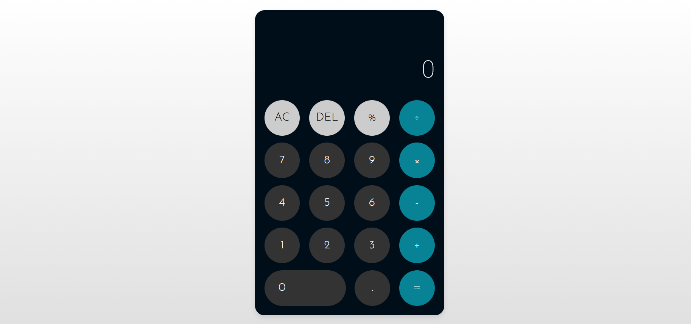

# Modern Calculator

A sleek, responsive calculator built using **HTML, CSS, and JavaScript**. Designed with a clean UI, modern styling, and smooth button interactions, this project is ideal as a front-end practice project or as a reusable calculator component.

---

## 📌 Features

* Modern minimalist interface
* Responsive design for small screens
* Button click animations
* Calculation history display
* Clear (`AC`) and delete (`DEL`) functions
* Percentage calculation support

---

## 🛠️ Built With

* HTML5
* CSS3 (Flexbox + Media Queries)
* Vanilla JavaScript

---

## 📂 Folder Structure

```
project-folder/
│
├── css/
│   └── style.css
│
├── assests/
│   ├── img/
│   │   └── screenshot.png
│   └── js/
│       └── main.js
│
├── index.html
├── README.md
└── LICENSE
```

---

## 🚀 How to Run

1. Download or clone this repository.
2. Open the project folder.
3. Double-click `index.html`
   or open it in your browser.

No installation or server required.

---

## 🧠 How It Works

The calculator logic is handled in **main.js**:

* Button clicks are detected using event listeners.
* Input values are stored in a variable.
* Special buttons (`AC`, `DEL`, `=`) trigger specific logic.
* Expressions are evaluated dynamically using JavaScript.

---

## 📸 Preview



---

## 📜 License

This project is licensed under the **MIT License** — you are free to use, modify, and distribute it.

---

## 👤 Author

**Sultan Achmad**

---

⭐ *If you like this project, consider giving it a star!*

